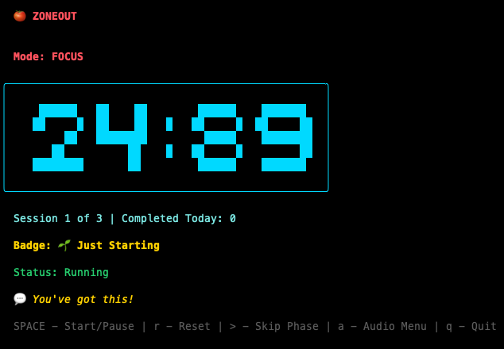

# 🍅 Zoneout - Pomodoro Timer

A beautiful, terminal-based Pomodoro timer written in Go with MP3 white noise support and transition sound effects.



## ⚡ Quick Start (TL;DR)

**No installation needed!** Just download the binary for your platform and run it.

### For macOS (Apple Silicon - M1/M2/M3):
```bash
# 1. Download (click the link or use curl)
curl -L https://github.com/bpessanha/zoneout/releases/download/v1.1.0/zoneout-macos-arm64 -o zoneout

# 2. Make it executable
chmod +x zoneout

# 3. Run it
./zoneout
```

### For macOS (Intel):
```bash
curl -L https://github.com/bpessanha/zoneout/releases/download/v1.1.0/zoneout-macos-amd64 -o zoneout
chmod +x zoneout
./zoneout
```

### For Linux:
```bash
curl -L https://github.com/bpessanha/zoneout/releases/download/v1.1.0/zoneout-linux-amd64 -o zoneout
chmod +x zoneout
./zoneout
```

### Terminal Explained (for beginners):
1. **Open Terminal** (macOS: Applications → Utilities → Terminal, Linux: Ctrl+Alt+T)
2. **Paste one of the commands above** and press Enter
3. **That's it!** The app is ready to use - everything is built-in

---

## Features

- **Pomodoro Cycles**: Default 3 sessions of 25-minute focus + 5-minute breaks
- **Real-time Timer**: Live countdown display with minutes and seconds
- **Focus & Break Modes**: Automatic transitions between focus sessions and breaks
- **🔊 Embedded Audio**: All sounds and whitenoise included in the binary
  - Transition sounds (start/stop) - built-in
  - Rain & thunder whitenoise - built-in
  - Add your own MP3s in `~/.zoneout/whitenoise/` (optional)
- **💬 Embedded MOTD**: Random motivational messages (refreshes every 24 hours)
  - Built-in message set included
  - Add your own messages in `~/.zoneout/motd/` (optional)
- **Statistics**: Track completed sessions (stored in `~/.zoneout/`)
- **Beautiful TUI**: Built with BubbleTea and Lipgloss for a modern terminal interface

## Installation

### Pre-built Binaries (Recommended)

Download from [GitHub Releases](https://github.com/bpessanha/zoneout/releases) - See **Quick Start** section above.

### Build from Source

If you want to build from source:

**Prerequisites:**
- Go 1.18 or higher

**Build:**
```bash
git clone https://github.com/bpessanha/zoneout.git
cd zoneout
go build -o zoneout
./zoneout
```

## Usage

```bash
./zoneout
```

### Controls

| Key | Action |
|-----|--------|
| `SPACE` | Start/Pause timer |
| `R` | Reset cycle (back to idle) |
| `r` | Reset session (restart timer) |
| `>` | Skip to next phase |
| `a` | Toggle audio menu |
| `m` | Get new random MOTD message |
| `h` or `?` | Toggle help menu |
| `↑/↓` | Navigate menu |
| `ENTER` | Select audio |
| `ESC` | Close menu |
| `q` | Quit |

## Configuration

### Directories

The app automatically creates these directories in your home folder on first run:

- **`~/.zoneout/whitenoise/`** - Add your own MP3 files here (plays during focus sessions)
  - Embedded `rain-and-thunder.mp3` is always available
  - Add custom MP3s to supplement or replace the embedded audio
- **`~/.zoneout/motd/`** - Add your own `.txt` files with motivational messages
  - One message per line per file
  - Embedded messages are always available
  - Your custom messages combine with embedded messages
- **`~/.zoneout/.zoneout_stats`** - Stats file (auto-created, tracks your sessions)

### Default Settings

- **Total Sessions**: 3
- **Focus Duration**: 25 minutes
- **Break Duration**: 5 minutes

## Project Structure

**Source Code:**
```
zoneout/
├── main.go              # Entry point
├── motd.go              # Message of the day logic
├── models/
│   └── pomodoro.go      # Timer logic
├── ui/
│   └── model.go         # UI and interactions
├── audio/
│   └── player.go        # Audio playback
├── stats/
│   └── stats.go         # Session statistics
├── whitenoise/          # Embedded whitenoise (rain-and-thunder.mp3)
├── sounds/              # Embedded transition sounds (start/stop.mp3)
├── motd/                # Embedded MOTD messages (messages.txt)
├── go.mod               # Go module
└── README.md
```

**Note:** All assets in the directories above are embedded into the binary during build. Users don't need these files - they're already included!

## License

MIT
